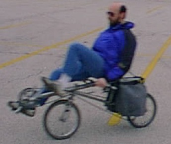

At Jaco Unlimited, we build folding recumbent bicycles.  In under 10
minutes, you can fold one of our bikes and put it into a suitcase.  You can
take it on an airplane as checked baggage or put it in the trunk of a car.
Then, you can unfold it and be on the road again in under 10 minutes.  Best of
all, it's a great bike to ride!

## Why a Recumbent?

I built my first bike in 1980 because my wrists were so sore I thought I was going to have to stop riding a bike altogether.  On a recumbent, the wrists bear no weight, so my wrist problem went away almost immediately.  At the same time, my lower back, shoulders, neck, butt, and crotch also stopped having bike-related tension and pain and I no longer suffered from numb-nuts on long rides.  (Since then, the medical world has discovered that many men suffer erectile dysfunction, sometimes permanently, as a result of riding on conventional bikes.  This doesn't happen with recumbents.)

So, the recumbent stops some pain, and relieves some problems, but it also has several positive attributes of its own. With the lower seat height, and corresponding lower center of gravity, the bike is more stable, handles better, and brakes better.

With the recumbent seat position, and the rider's legs out of the windstream, aerodynamics are greatly improved.  Since wind resistance accounts for about 90% of a rider's power output at 20 miles per hour, and that number increases as the cube of absolute wind speed, aerodynamics are extremely important to the cyclist.  (Riding at 10 miles per hour into a 10 mph wind is the same as trying to ride at 20 miles per hour.  Trying to ride at 10 mph into a 15 mph headwind would be like riding at 25 mph.  Can you ride at 25 mph?  I can't, or at least not for more than a few blocks.)

The rider sits in a comfortable, semi-reclining position, supported by a chair-like seat.  With the head up, it's easier to see, and the field of view is much larger than on a conventional bike.  (We won't even mention the comfort advantage over a conventional bike seat, as there is no comparison.)
